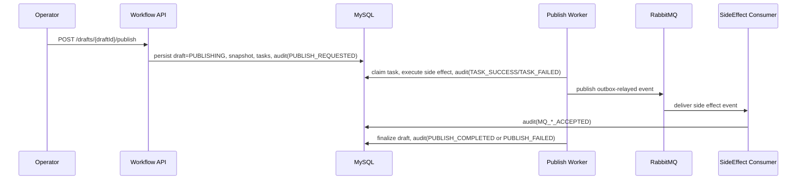

# Operations（运行与配置）

## 服务定位

这是一个前后端分离模式下的独立后端服务：
- 服务名：`content-publish-service`
- 接口协议：HTTP JSON REST
- 典型上游：管理后台、内容运营前端、内部编排服务
- 典型下游：搜索索引服务、读模型同步服务、通知服务

## Profiles

### 默认（无 profile）
- 默认使用内存 H2（便于本地演示与单测）
- readiness 默认不强依赖 Redis（避免本地未启动 Redis 直接不可用）

### `mysql`
- 切换到 MySQL 数据源
- 通过 `DB_URL / DB_USER / DB_PASSWORD` 注入连接信息

### `redis`
- 启用 Redis 作为 Spring Cache 的实现
- readiness 额外包含 Redis 检查
- 通过 `REDIS_HOST / REDIS_PORT / REDIS_PASSWORD / REDIS_DB` 注入连接信息

### `rabbitmq`
- 启用 RabbitMQ 连接参数配置样例（用于 Outbox 投递演进）
- 默认不强制启动 MQ；relay 默认关闭
- 通过 `RABBIT_HOST / RABBIT_PORT / RABBIT_USER / RABBIT_PASSWORD / RABBIT_VHOST` 注入连接信息

### `ops`
- 面向运维/演示的可观测性 profile
- 增加暴露的 actuator 端点、Prometheus 直方图、Tomcat access log 等配置
- 建议只在内网或网关鉴权后使用（不要裸奔暴露到公网）

### `loadtest`
- 面向压测/基准测试的 profile
- 调整 Tomcat 线程/连接参数、减少低价值日志干扰
- 仅用于压测环境

## 环境变量清单（常用）

数据库（MySQL profile 常用）：
- `DB_URL`：JDBC url
- `DB_USER`：用户名
- `DB_PASSWORD`：密码
- `DB_DRIVER`：驱动类（默认 `com.mysql.cj.jdbc.Driver`）

Redis（redis profile 常用）：
- `REDIS_HOST`
- `REDIS_PORT`
- `REDIS_PASSWORD`
- `REDIS_DB`

服务端口：
- `SERVER_PORT`（Spring Boot 标准变量；也可在 yml 里配置）

运维端口（ops profile 可选）：
- `MANAGEMENT_PORT`：actuator 独立端口（默认 8081）

## 运行配置样例

仓库内提供了可直接拷贝的配置样例（不建议直接用于生产）：
- `src/main/resources/application-example.yml`
- `src/main/resources/application-mysql.yml`
- `src/main/resources/application-redis.yml`
- `src/main/resources/application-ops.yml`
- `src/main/resources/application-loadtest.yml`
- 缓存 TTL 与 key 前缀可通过环境变量覆盖：`CACHE_PREFIX / CACHE_DRAFT_DETAIL_TTL / CACHE_DRAFT_LIST_TTL / CACHE_DRAFT_STATUS_COUNT_TTL`

缓存设计细节见：[REDIS_CACHE.md](D:/java/content-publish-workflow/docs/REDIS_CACHE.md)

## 健康检查与监控

默认暴露：
- `/actuator/health`
- `/actuator/health/liveness`
- `/actuator/health/readiness`
- `/actuator/metrics`
- `/actuator/prometheus`

readiness 检查项：
- 默认：`ping + db`
- 开启 `redis` profile：`ping + db + redis`

## 可观测性（Actuator/Prometheus/Logging）

默认暴露端点较少（适合本地与最小演示）。如果你要面试展示运维能力，建议打开 `ops` profile，并把 actuator 放到独立端口：

```bash
SPRING_PROFILES_ACTIVE=ops,mysql,redis
MANAGEMENT_PORT=8081
```

然后通过：
- 业务端口：`http://127.0.0.1:8080`
- 运维端口：`http://127.0.0.1:8081/actuator/prometheus`

更完整的说明与 Prometheus/Grafana 资产见：
- `docs/OBSERVABILITY.md`

压测与基准测试资产见：
- `docs/LOAD_TEST.md`

## 前端联调

前端可以直接使用 OpenAPI 自助联调：
- OpenAPI JSON：`/v3/api-docs`
- Swagger UI：`/swagger-ui`

## 人工恢复入口

当前版本已经补齐第一批面向运维/人工介入的恢复 API，用于处理发布任务和 outbox 事件的失败恢复：

- `GET /api/workflows/drafts/{draftId}/recovery/tasks`
  用于查看当前草稿下处于 `FAILED/DEAD` 的发布任务，并标记哪些任务仍属于当前 `publishedVersion`、可以直接人工恢复。
- `POST /api/workflows/drafts/{draftId}/tasks/{taskId}/manual-retry`
  用于对单个 `FAILED/DEAD` 发布任务执行人工重试；任务会回到 `PENDING`，如果草稿原来处于 `PUBLISH_FAILED`，会被重新推进到 `PUBLISHING`。
- `POST /api/workflows/drafts/{draftId}/tasks/manual-retry-current-version`
  用于对当前 `publishedVersion` 下所有可恢复的发布任务做批量人工重试。
- `GET /api/workflows/outbox/events/recovery?draftId={draftId}&limit=50`
  用于查看 `FAILED/DEAD` 的 outbox 事件；`draftId` 可选，便于只看某个草稿对应的异步事件。
- `POST /api/workflows/outbox/events/{outboxEventId}/manual-retry`
  用于把单个失败 outbox 事件重新置回可投递状态。

权限约束：
- 发布任务恢复查询：`TASK_VIEW`
- 发布任务人工恢复：`TASK_MANUAL_REQUEUE`
- outbox 恢复查询/操作：`ADMIN + OUTBOX_MANUAL_REQUEUE`

说明：
- 兼容旧入口：原有 `manual-requeue` API 仍可继续使用。
- 当前人工恢复只允许操作“当前发布版本”的发布任务，避免对历史版本副作用做误恢复。

## 审计时间线

当前日志模型已经支持结构化审计上下文，关键字段包括：
- `traceId / requestId`
- `operatorId / operatorName`
- `targetType / targetId`
- `publishedVersion / taskId / outboxEventId`
- `beforeStatus / afterStatus`
- `result / errorCode / errorMessage`

常用查询入口：
- `GET /api/workflows/drafts/{draftId}/logs`
  查看单个草稿的结构化审计日志列表（倒序）。
- `GET /api/workflows/drafts/{draftId}/logs/timeline?traceId=publish:{draftId}:{publishedVersion}`
  按一次发布链路的 `traceId` 拉取完整时间线，适合排查“发布请求 -> 任务执行 -> 最终状态推进”的全链路轨迹。
- `GET /api/workflows/drafts/{draftId}/logs/publish-timeline?publishedVersion={publishedVersion}`
  按发布版本直接拉取聚合后的时间线视图，返回 `initiator / finalStatus / finalResult / startedAt / finishedAt / totalEvents / events[]`，更适合前端详情页和面试演示。

推荐展示方式：
- 优先用 `publish-timeline` 作为页面主接口，直接展示一次发布的摘要和时间线。
- 需要精查某条链路时，再回退到 `traceId` 维度的 `logs/timeline` 明细接口。

一次典型发布的审计时间线可以口述为：



## CORS 建议

项目默认不全量放开 CORS。

如果前端开发环境需要跨域，建议按环境配置“白名单 origin”，不要直接 `*` + credentials。


