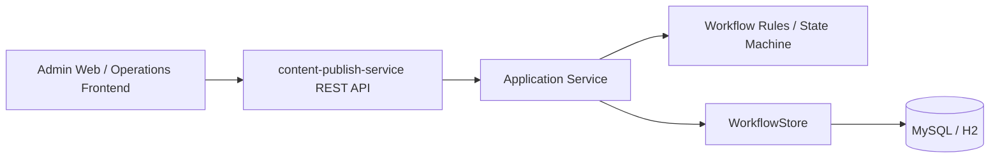

# Service Architecture

## Service Role
This project is positioned as a single backend service inside a microservice system:

- service name: `content-publish-service`
- style: frontend-backend separation
- protocol: HTTP JSON REST
- responsibility: content draft lifecycle and release workflow

It is intentionally not a full platform. It is one domain service with a sharp boundary.

中文说明（定位一句话）：
- 它是“内容发布中心”的工作流域服务，前后端分离，只提供 HTTP JSON API，可被网关统一鉴权后对管理端开放。

Related docs:
- `docs/OPERATIONS.md`
- `docs/FRONTEND_INTEGRATION.md`
- `docs/API_DESIGN.md`
- `docs/ERROR_CODES.md`

## Integration Surfaces (Frontend-Backend Separation)
- Frontend talks to this service via HTTP JSON REST only.
- This service does not render pages; it returns structured JSON responses.
- API docs: OpenAPI endpoints are exposed for frontend integration.
  - OpenAPI JSON: `/v3/api-docs`
  - Swagger UI: `/swagger-ui`

## What This Service Owns
- draft creation and update
- review submission
- review approval and rejection
- publish state transitions
- publish snapshots
- rollback based on snapshots
- publish task records
- workflow audit logs

## What This Service Does Not Own
- frontend page rendering
- user center and login
- notification delivery
- search indexing worker
- gateway and routing

Those systems can call this service, but should not be implemented inside it.

## Operations Endpoints
Actuator is enabled for operations and monitoring:
- Liveness: `/actuator/health/liveness`
- Readiness: `/actuator/health/readiness`
- Metrics: `/actuator/metrics`
- Prometheus: `/actuator/prometheus`

Redis readiness is profile-controlled:
- default: readiness checks `ping` + `db` (does not require Redis)
- `redis` profile: readiness checks `ping` + `db` + `redis`

OpenAPI is exposed for frontend self-service integration:
- OpenAPI JSON: `/v3/api-docs`
- Swagger UI: `/swagger-ui`

## Request Flow

## Layering
- `interfaces`: REST controllers, DTOs, VOs
- `application`: workflow service orchestration
- `domain`: entities and enums
- `infrastructure`: JPA entities, repositories, persistence adapters
- `common`: shared response and exception handling

## Deployment Notes（微服务化部署建议）

- 推荐部署在网关/Ingress 后面：网关负责鉴权、限流、统一日志与跨域策略；本服务只负责业务工作流。
- 对外暴露的主要是业务 API：`/api/workflows/**`，运维面使用 `/actuator/**`。
- 作为“域服务”，本服务的数据库是独立 schema（例如 `cpw`），避免与其他域服务混库混表。
